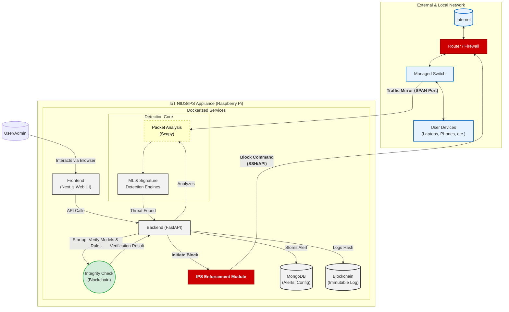

# 🏗️ NIDS System Architecture - Enhanced

## 🔭 High-Level Overview

The Network Intrusion Detection System (NIDS) operates as a distributed full-stack application. It separates concerns between high-performance data processing (Backend) and user interaction (Frontend).

## 📐 Architecture Diagram

## 📂 Component Breakdown

### 1. Backend Layer (`/backend`)
The brain of the operation. Built with **FastAPI** for high performance and async capabilities.

*   **Location**: `backend/app/`
*   **Entry Point**: `backend/main.py` (corrected from `main_working.py`)

#### Core Modules (`backend/app/core/`)
*   **Packet Sniffer** (`packet_sniffer.py`):
    *   Uses `Scapy` to capture raw packets from the network interface.
    *   Extracts features (IP, Port, Protocol, Flags) for analysis.
*   **ML Detector** (`ml_detector.py`):
    *   **Models**: Random Forest, Isolation Forest.
    *   **Function**: Analyzes packet features to detect anomalies (Zero-day attacks).
*   **Signature Detector** (`signature_detector.py`):
    *   **Mechanism**: RegEx and rule-based matching.
    *   **Targets**: Known patterns like SQL Injection string patterns or specific DDoS signatures.
*   **Orchestrator** (`nids_orchestrator.py`):
    *   Manages the lifecycle of the sniffer and detection threads.
    *   Ensures thread safety and clean shutdowns.
*   **Alert Manager** (`alert_manager.py`):
    *   Aggregates findings from both detectors.
    *   De-duplicates alerts and saves them to the database.
*   **IPS Manager** (`ips_manager.py`):
    *   **Function**: Automated Threat Prevention (IPS).
    *   **Mechanism**: Interfaces with the network router or local firewall (SSH/API/cli) to block malicious IP addresses upon high-confidence threat detection.
*   **Integrity Manager** (Implicitly used by `main.py` via `BlockchainClient`):
    *   **Function**: Verifies checksums of ML models and rules against records on the blockchain at startup to detect tampering.

### 2. Frontend Layer (`/frontend`)
The control center. Built with **Next.js 15** and **React**.

*   **Location**: `frontend/app/`
*   **Styling**: Tailwind CSS + Shadcn UI.

#### Key Areas
*   **Dashboard**: Real-time overview of traffic volume and high-severity alerts.
*   **Detection Control**: Interfaces to Start/Stop the sniffer and select interfaces.
*   **Traffic Analysis**: Visual charts (Recharts) showing protocol distribution.

### 3. Data Layer
*   **MongoDB**: Stores historical alerts and configuration.
*   **Blockchain**: Stores immutable hashes of alerts and critical system components (ML models, rules) for audit and integrity verification.
*   **File System**:
    *   `backend/logs/`: Application logs (`nids.log`).
    *   `backend/data/`: Training datasets.
    *   `backend/app/ml_models/`: Serialized ML models (`.joblib`).

## 🔄 Data Flow

1.  **Capture**: `Packet Sniffer` intercepts a packet from the Network Interface Card (NIC).
2.  **Pre-processing**: Packet is parsed; features (size, tcp_flags, window) are extracted.
3.  **Parallel Analysis**:
    *   **Path A**: `Signature Detector` checks strictly against known attack rules.
    *   **Path B**: `ML Detector` runs the feature vector through the trained model to get an anomaly score.
4.  **Decision**: If either detector triggers, an `Alert` object is created.
5.  **Prevention (IPS)**: If configured and threat confidence is high, the `IPS Manager` initiates a block command to the network router.
6.  **Notification & Audit**: The `Alert Manager` pushes the alert to the database and records a hash on the blockchain.
7.  **Visualization**: The Frontend polls/receives the alert and updates the UI instantly.

## 🛠️ Technology Stack

| Component | Technology | Version |
|-----------|------------|---------|
| **Backend Framework** | FastAPI | 0.68+ |
| **Language** | Python | 3.10+ |
| **Packet Capture** | Scapy | 2.5+ |
| **ML Engine** | Scikit-learn | 1.3+ |
| **Frontend Framework** | Next.js | 15.2 |
| **UI Library** | React | 19.x |
| **Styling** | Tailwind CSS | 3.x |
| **Database** | MongoDB | Latest |
| **Blockchain** | (E.g., Ganache for development, custom for production) | Latest |