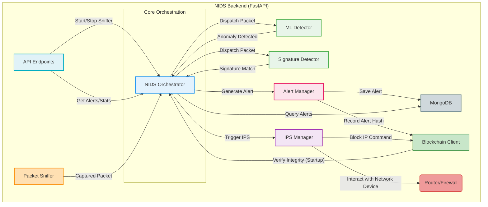

# ⚙️ NIDS Backend Interactions Diagram

## 🎯 NIDS Orchestrator: The Central Hub

This diagram details the interactions centered around the `NIDSOrchestrator` within the FastAPI backend, showcasing its role in managing detection, alerting, and prevention processes.

