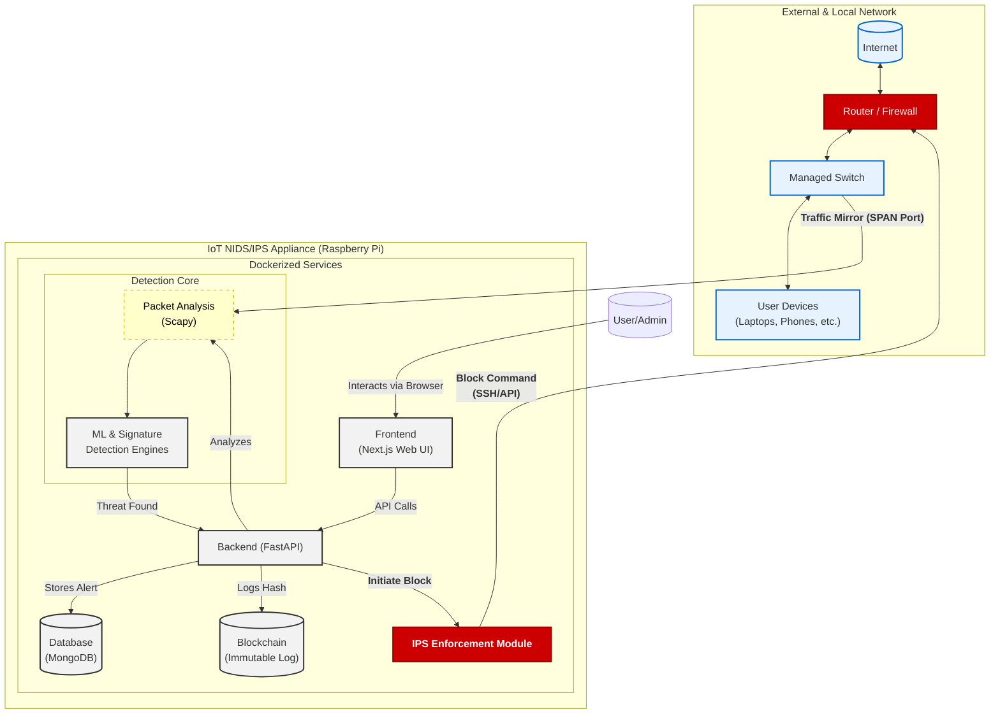

# Project Report: An Advanced IoT-Enabled NIDS/IPS Appliance with ML and Blockchain Integration

---

## 1. Executive Summary

This document provides a detailed overview of a next-generation, IoT-enabled security appliance designed to address the sophisticated challenges of modern cybersecurity. The project evolves from a software-only concept into a tangible hardware solution, running as a standalone system on a **Raspberry Pi**. It functions as a complete Network Intrusion Detection and **Prevention** System (NIDS/IPS), integrating a dual-engine threat detection mechanism with a novel blockchain-based integrity framework. The system's primary function is to autonomously monitor network traffic, identify a wide range of threats using advanced Machine Learning, **automatically block malicious IP addresses** by interfacing with the main network router, and provide tamper-proof alerts and audit trails through its Next.js web interface and blockchain backend. This IoT appliance model makes advanced, enterprise-grade security accessible and easy to deploy in small office, home office (SOHO), and specific IoT network environments.

---

## 2. Project's Problem Statement (Elaborated)

The foundational problem is that the digital transformation of our society, economy, and critical infrastructure has outpaced the evolution of the security systems designed to protect it. This creates a dangerous security deficit, which manifests in three critical, interconnected challenges:

1.  **The Obsolescence of Traditional Defenses & The Rise of Zero-Day Threats:** Legacy security systems are overwhelmingly reliant on signature-based detection. This model is fundamentally reactive and fails against modern "zero-day" attacks and polymorphic attacks.
2.  **The Crisis of Data Integrity & Forensic Certainty:** In the aftermath of a security breach, a primary objective for any sophisticated attacker is to cover their tracks by altering or deleting security logs. This makes it impossible to conduct a reliable forensic investigation, understand the scope of the breach, or provide admissible evidence for legal action.
3.  **The Accessibility Gap for Advanced Security:** Enterprise-grade detection and prevention systems are often complex, expensive, and require dedicated IT expertise to deploy and manage. This leaves small businesses, home offices, and critical but isolated IoT networks (e.g., in manufacturing or research) dangerously underserved and vulnerable.

---

## 3. Solution Overview (Elaborated)

This NIDS/IPS provides a comprehensive solution by embodying three pillars of innovation, now delivered in a compact, standalone appliance form factor.

1.  **Intelligent, Hybrid Threat Detection Engine:** The system uses a synergistic, dual-engine system to provide layered defense.
    *   **Signature-Based Engine:** Acts as a high-speed "filter" for the massive volume of known, common attacks.
    *   **Machine Learning (ML) Anomaly Engine:** This innovative core learns the unique "rhythm" of the network and detects sophisticated, unknown attacks by identifying subtle deviations and anomalies.

2.  **Automated Threat Prevention (IPS Functionality):** This is a core feature of the appliance. The system does not just detect threats; it acts on them. Upon identifying a high-confidence threat, the appliance **automatically interfaces with the main network's router or firewall to block the malicious IP address**, providing immediate, active defense without manual intervention.

3.  **Blockchain-Guaranteed Forensic Certainty:** The project creatively applies blockchain technology as a direct solution to the crisis of data integrity.
    *   **System Self-Awareness:** The NIDS uses the blockchain to maintain an immutable record of its own critical files, ensuring the appliance's software has not been subverted by an attacker.
    *   **Immutable Audit Trail:** For every critical security alert and blocking action, a cryptographic hash is generated and anchored to the blockchain. This creates a permanent, unalterable, and mathematically verifiable record of all events.

---

## 4. Core Features & Innovations (Elaborated)

*   **Standalone IoT Appliance:** The entire system is self-contained on a **Raspberry Pi**, acting as a plug-and-play security device that can be easily added to any network.
*   **Active Intrusion Prevention:** Beyond just detection, the system **automatically blocks threats** by programmatically adding malicious IPs to the main network firewall's blocklist.
*   **Real-time Deep Packet Inspection:** Utilizes `Scapy` to dissect network packets layer by layer, extracting a rich feature set for high-fidelity analysis.
*   **Synergistic Dual-Engine Detection:** Combines a fast, rule-based engine for known threats with a sophisticated ML engine for novel and anomalous activities.
*   **Dynamic Web-Based Command Center:** The Next.js dashboard provides analysts with real-time data visualizations, geo-location of threats, and a clear log of all automated blocking actions.
*   **Mathematically Guaranteed Audit Trail:** The blockchain integration provides a tamper-proof log of all detections and prevention actions with cryptographic certainty, which is crucial for forensic analysis.

---

## 5. System Architecture (Elaborated)

The architecture is designed for a self-contained appliance that intelligently interacts with the broader network infrastructure.

*   **Host Platform:** A **Raspberry Pi** (e.g., Model 4 or 5) running a hardened Linux OS (e.g., Raspberry Pi OS Lite) and the full NIDS/IPS software stack within **Docker containers**.
*   **Deployment Model (Out-of-Band with Active Response):**
    *   The Raspberry Pi connects its Ethernet port to a **SPAN/mirror port** on the main network switch. This allows it to passively receive a copy of all network traffic for analysis without affecting network performance.
    *   Crucially, the Pi is also connected to the network via Wi-Fi or its Ethernet port (on the management VLAN) to communicate with the main network router/firewall.
*   **Application Tiers (Running on the Pi):**
    *   **Frontend (Presentation Tier):** A Next.js (React) application serving the web dashboard.
    *   **Backend (Logic Tier):** A Python/FastAPI application. Its responsibilities are now expanded:
        *   Packet capture and dual-engine threat analysis.
        *   **NEW: Enforcement Module:** A new service that, upon receiving a high-confidence threat alert, connects to the main network router/firewall (via SSH or a vendor-specific API) and executes commands to block the offending IP address.
        *   API Gateway, Database Orchestration, and Blockchain Interaction.
    *   **Data Tier:** MongoDB and a private Blockchain node, both running in containers on the Pi.

#### **Architecture Design (Detailed Network & Appliance Flow)**

---

## 6. Feasibility, Impact, and Limitations

*   **Feasibility & Practicality:**
    *   **Hardware:** Using a modern Raspberry Pi is highly feasible for SOHO networks. The ARM architecture is well-supported by Docker and most modern programming languages.
    *   **Software:** The existing MVP proves the software's viability. The main new development effort is the "Enforcement Module," which is a straightforward engineering task assuming the target firewall has a programmable interface.

*   **Social Impact & Value:**
    *   **Democratizes Security:** This appliance model makes advanced, automated security accessible to small businesses and individuals who cannot afford complex enterprise solutions, significantly raising the security baseline for a huge segment of the digital economy.
    *   **Protects IoT Ecosystems:** Can be deployed to create secure "micro-enclaves" for vulnerable IoT devices in homes or industrial settings, preventing them from being used in botnets or as entry points for larger attacks.

*   **Limitations (Specific to this Implementation):**
    *   **Throughput Constraint:** The Raspberry Pi's processing power and I/O limits its use to lower-bandwidth environments (typically under 1 Gbps). It is not suitable for high-speed corporate data centers.
    *   **Firewall/Router Dependency:** The automatic IP blocking feature is **entirely dependent** on the user's main network router or firewall having a programmable interface (e.g., SSH access, a REST API, or UPnP). The appliance cannot block traffic on its own in this out-of-band model.
    *   **Encrypted Traffic:** The limitation of not being able to inspect encrypted payloads remains.

---

## 7. Future Scope (Revised)

With IPS functionality now a core feature, the future scope can focus on more advanced capabilities:

*   **Adaptive Prevention:** Instead of a permanent block, the system could implement "adaptive" responses: a short-term block for a first offense, a longer block for repeated attempts, and permanent blocking for critical threats.
*   **Multi-Appliance Fleet Management:** A cloud-based dashboard to manage and monitor a "fleet" of these IoT appliances deployed across multiple locations or clients, ideal for a Managed Service Provider (MSP).
*   **Advanced AI/ML Models:**
    *   **User and Entity Behavior Analytics (UEBA):** To detect compromised user accounts or devices based on behavioral changes.
    *   **Encrypted Traffic Analysis (ETA):** To find threats hidden within encrypted traffic by analyzing metadata patterns.
*   **Decentralized Threat Intelligence:** Expanding the blockchain component to allow the fleet of appliances to share threat intelligence securely and in real-time. If one Pi detects a new threat, the entire fleet can be pre-emptively protected.
*   **Broader Firewall/Router Integration:** Developing a library of "connectors" for popular SOHO router brands (e.g., Ubiquiti, pfSense, OpenWrt) to maximize out-of-the-box compatibility for the IP blocking feature.
