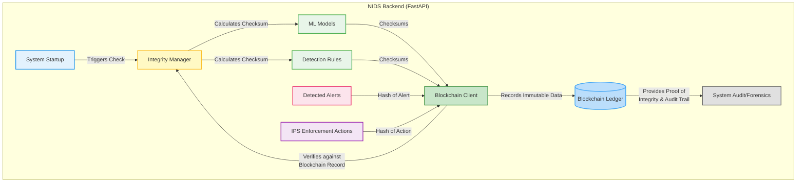

# 🔒 NIDS Security Features Diagram

## 🛡️ Leveraging Blockchain for Enhanced Security

This diagram illustrates how the NIDS utilizes blockchain technology to ensure integrity, provide an immutable audit trail, and enhance the security posture of the system.

